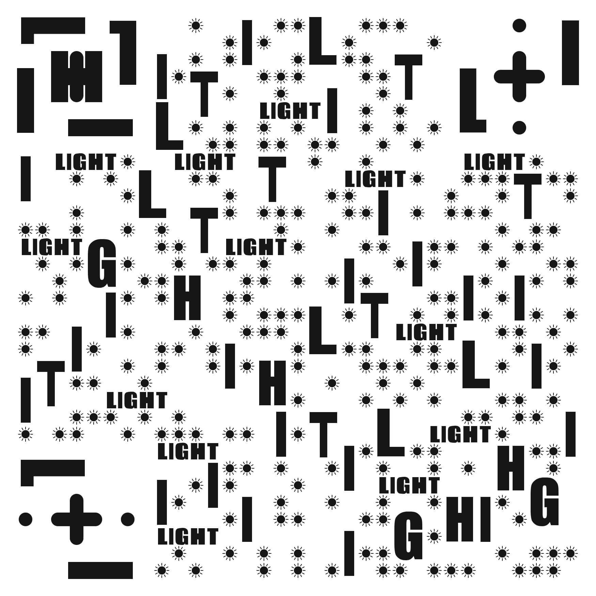
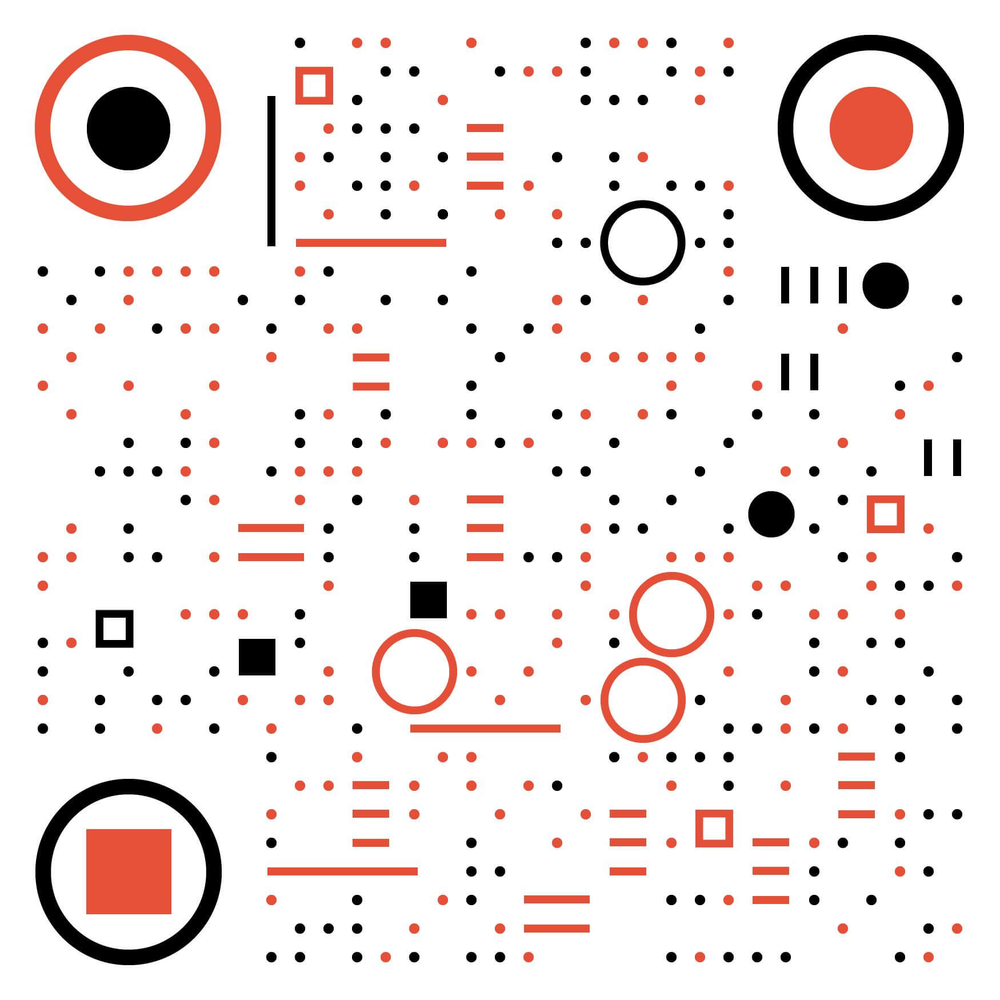

# 读书笔记 之 《通往财富自由之路》

## 阅读原著，请至得到APP或到书店购买正版专栏或书籍，另外强烈建议关注并follow [李笑来](https://github.com/xiaolai) 的github账号

---

## 从这里开始
**《通往财富自由之路》** 一书始发于 *得到App付费订阅专栏*  —— 订阅人数至今超过20W，留言更是不计其数，不仅是专栏名取得夺人眼球，更是当你拜读其中的内容并践行过后，会发现你的世界已经变成远非当初的自己能够想象的。那么，这本书里究竟告诉了我们什么呢?

如果你翻开自序，你一定会留意到这一段话：计算机的硬件和软件是可以升级的，其实人也是一样。“硬件”的升级是通过锻炼让自己更强壮，而“软件”的升级则是每当我们学习一项重大技能后，让自己的“操作系统”更新换代的过程。我们不断的追求更高级的计算机(你手里的iphone)，不断升级它们的操作系统，为什么我们竟然疏于对我们自己“操作系统”的升级呢？这段话其实就是整本书的宗旨所在 —— 帮助我们完成自己“操作系统”的升级指南！注意，为什么这里说这仅仅是一部指南呢？因为无论作者说的再好，道理再正确，你心里再怎么认同，但只要你不去做，不去践行，这一切都是白搭 —— 所以你别妄想仅仅通过看一本书就财富自由了！如果是这样，那你家里只要多买几本书，甚至书写的内容都不重要，只要书名叫做《教你一分钟赚一个亿》、《保你一辈子衣食无忧》…不就行了么？

## 财富自由
其实 **财富自由** 并不是人生的终点，充其量只能算是人生的一个里程碑而已，能伴随你到终点的，只有你自己以及时间而已！说到时间，李笑来老师还有一本书叫做《把时间当做朋友》，第一次出版于2009年，很巧的是罗振宇的跨年演讲也叫做【时间的朋友】，看来这些牛人都明白一个事实 —— 对于每个人而言，事实上都无法管理时间，时间根本不会因为谁的意志而有所变化，最好的办法则是和它做朋友，并且时间永远都是是一个不会背叛你的忠实的朋友 —— 你如何对待它，它也会对你如实反馈！

## 时间
由此，书籍中为我们总结了几个和时间打交道的原则：
1. 凡是能用钱买来的时间就是便宜的，凡是能用时间换来注意力的持续就是有价值的；

2. 由上可推出之所以我的时间能卖出去，就是因为总体上来看花钱买时间更划算；

3. 从价值上来看：**注意力** > 时间 > 金钱；

## 注意力
上面提到了 **注意力** 这个概念，不知道你对它作何感想呢？不过所有对于时间有觉知的人，都会格外的珍惜“注意力”！不错，正如笑来老师所说，我们最宝贵的财富并非时间，更非金钱，而是 *“注意力”*。注意力和时间最大的区别在于，后者并不受你所控，前者则是只受你控制，而且注意力是你唯一可以调用且能有所产出的资源！ —— 它是在任何地方“挖掘”价值的最基本工具。对于注意力的使用，要避免的坑有很多，书中也总结出了三个大坑：
1. 莫名其妙地凑热闹

2. 心急火燎的随大流

3. 操碎了别人的心肝儿

书中不仅提出了注意力需要避免的坑，也给出了如何科学的提高注意力的方法，除此之外，还有很多平时我们都不曾注意过的，甚至想也没想过的概念，存放于这本书的各个角落里，等着追求 better me 的我们去探索，去践行...

## 最后
以上，是自己对这本书的一些浅显的总结罢。但我依旧在路上！

---

## 导航
1. [最宝贵的东西](/最宝贵的东西.md)

2. [交易的策略](/交易的策略.md)

3. [最大的负担](/最大的负担.md)

4. [活在未来](/活在未来.md)

5. [遇到贵人的科学方法](/遇到贵人的科学方法.md)

6. [何为资本](/何为资本.md)

7. [定义落后](/定义落后.md)

8. [多维度打造竞争力](/多维度打造竞争力.md)

9. [元认知能力](/元认知能力.md)

10. [提升元认知能力的有效方法](/提升元认知能力的有效方法.md)

11. [神奇的“万能钥匙”](/神奇的“万能钥匙”.md)

12. [一念一世界](/一念一世界.md)

13. [避免错过升级的机会](/避免错过升级的机会.md)

14. [这是个“有生命”的世界](/这是个“有生命”的世界.md)

15. [彻底戒掉抱怨这个恶习](/彻底戒掉抱怨这个恶习.md)

16. [看得见别人的好](/看得见别人的好.md)

17. [正确本身的价值](/正确本身的价值.md)

18. [是什么决定命运](/是什么决定命运.md)

19. [自我驱动力的由来](/自我驱动力的由来.md)

20. [认知、选择、培养正确的刚需](/认知、选择、培养正确的刚需.md)

21. [“避险”才是投资的刚需](/“避险”才是投资的刚需.md)

22. [尊重资本量级的差异](/尊重资本量级的差异.md)

23. [近在“眼前”的机会](/近在“眼前”的机会.md)

24. [开始投资的条件](/开始投资的条件.md)

25. [能否准确预测股价](/能否准确预测股价.md)

26. [关于“贪婪”和“诱惑”](/关于“贪婪”和“诱惑”.md)

27. [“早”是不是决定性因素](/“早”是不是决定性因素.md)

28. [“All-In”意味着什么](/“All-In”意味着什么.md)

29. [最简单的安全投资策略](/最简单的安全投资策略.md)

30. [长期究竟是多长](/长期究竟是多长.md)

31. [如何做到两倍薪水](/如何做到两倍薪水.md)

32. [合格的时间的买卖人](/合格的时间的买卖人.md)

33. [为什么一定要会写作](/为什么一定要会写作.md)

34. [决定价格的最核心要素](/决定价格的最核心要素.md)

35. [什么才是人生的头等大事](/什么才是人生的头等大事.md)

36. [关于“创业”的选择](/关于“创业”的选择.md)

37. [提高“成长率”的方法论](/提高“成长率”的方法论.md)

38. [知识究竟是什么](/知识究竟是什么.md)

39. [如何提高“智商”](/如何提高“智商”.md)

40. [起步时，最重要的是什么](/起步时，最重要的是什么.md)

41. [生命中最重要的东西](/生命中最重要的东西.md)

42. [成为配得上希望的那个人](/成为配得上希望的那个人.md)

43. [认知升级最重要的工具](/认知升级最重要的工具.md)

44. [人生的作弊器](/人生的作弊器.md)

45. [投资世界最基本的技能](/投资世界最基本的技能.md)

46. [投资世界的基本面貌](/投资世界的基本面貌.md)

47. [精明的时间买卖人](/精明的时间买卖人.md)

48. [最高级的个人商业模式](/最高级的个人商业模式.md)

49. [人生的终极问题](/人生的终极问题.md)

50. [原则](/原则.md)

51. [提问](/提问.md)

52. [执行力](/执行力.md)

---

## 彩蛋
- [定投践行群](https://github.com/BobbyLH/articles/blob/master/%E5%AE%9A%E6%8A%95%E8%B7%B5%E8%A1%8C%E7%BE%A4.md)

    2019年7月底，笑来老师着手成立了一个名为 **BOX 定投践行群**。迄今为止，社群人数已经突破4000人，而更让人惊讶的是加入这个群的入群费并不低 —— 需要支付等价于 2020.73 人民币的BTC(比特币)，除此之外，还需要群内的人提供邀请码。

    门槛那么高，为何依然有这么多人趋之若鹜的加入这个社群呢？很多人是阅读了 [《定投改变命运》](https://ri.firesbox.com/#/)，而后醍醐灌顶，大梦初醒，毫不犹豫的加入了践行群。而若是你也想要加入，[《定投践行群入群指南》](https://github.com/BobbyLH/articles/blob/master/%E5%AE%9A%E6%8A%95%E8%B7%B5%E8%A1%8C%E7%BE%A4.md) 可以给你一些指导。

- [笑来写作课](https://github.com/BobbyLH/articles/blob/master/%E7%AC%91%E6%9D%A5%E5%86%99%E4%BD%9C%E8%AF%BE.md)
    
    **写作的本质，就是向受众表达你的感知的过程** —— 这是我学习写作课后的一个感悟。

    无论是我们熟知的《把时间当做朋友》、《通往财富自由之路》、《定投改变命运》，亦或是十几年前出版的《TOEFL核心词汇21天突破》，笑来老师的在文字上的创作能力都是摆在那儿，毋庸置疑的。“不仅畅销，而且还长销” —— 这是他给自己的作品定制的基本原则，做不到这一点，也没必要创作。

    而且，在时间慢慢流逝的过程中，笑来老师的创作能力也在同步提升。和二十多年前，他发表在自己博客上的文字比起来，现在他出版的作品，不再是 “干巴巴的没有生气的文字描述”。一个概念或一个感知，或许你早就知晓或是观察到，但就是没办法像他一样，用一段或几段文字就表达的清清楚楚，就好像它们原本是你想要说的话一样，只不过经过了笑来老师的手，递到了你的眼前。

    不过，笑来老师也说过，想要打磨好写作的能力，是需要至少一辈子的功夫的，而 [笑来写作课](https://github.com/BobbyLH/articles/blob/master/%E7%AC%91%E6%9D%A5%E5%86%99%E4%BD%9C%E8%AF%BE.md) 是一个 “启蒙” 的课堂，师傅领进门，修行在个人，有志气的你，在有灯塔指引的情况下，难道还怕会迷失航向？

- [十年五本书](https://github.com/BobbyLH/articles/blob/master/%E5%8D%81%E5%B9%B4%E4%BA%94%E6%9C%AC%E4%B9%A6.md)

    在激荡中寻找机会，笑来老师和你一起解读他 [十年的五本书](https://github.com/BobbyLH/articles/blob/master/%E5%8D%81%E5%B9%B4%E4%BA%94%E6%9C%AC%E4%B9%A6.md)，从《通往财富自由之路》到《让时间陪你慢慢变富》，都是让普通人超越阶层，实现财富自由的人生指南。

- [相约7年后](https://github.com/BobbyLH/articles/blob/master/%E7%9B%B8%E7%BA%A6%E4%B8%83%E5%B9%B4%E5%90%8E.md)

    笑来老师说：人的血液和细胞，几乎每隔七年就会全部更新换代一次；从这个角度看，每隔七年，你仿佛也 “涅槃重生”；
    
    七年就是一辈子，七年之后，你想成为什么样的人呢？[0.99元 听一堂课](https://github.com/BobbyLH/articles/blob/master/%E7%9B%B8%E7%BA%A6%E4%B8%83%E5%B9%B4%E5%90%8E.md)，为你7年后美好的生活，埋下第一颗种子！

## 联系我
结交新朋友一直是一件很快乐的事情，尤其是我们之间有相同的目标和兴趣的时候。

### 微信：
 

### Mixin:
 